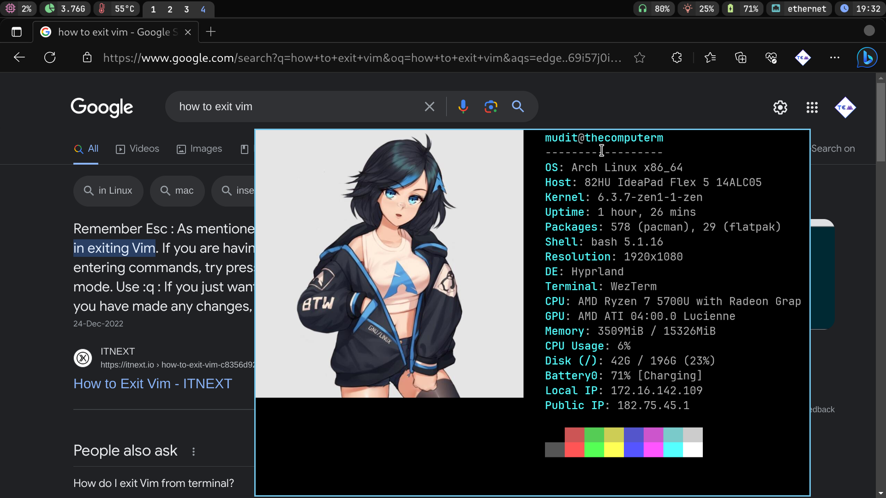

# Dotfiles

This setup is tested with an EndeavourOS base install with no desktop.

---

# Preview





## Software

- Hyprland window manager
    - `hyprland`
- Alacritty terminal emulator
    - `alacritty`
- Microsoft Edge (f*** you thats why)
    - `microsoft-edge-stable-bin`
- Thunar file manager
    - `thunar`
    - `thunar-volman`
    - `thunar-archive-plugin file-roller`
    - `gvfs`
    - `tumbler ffmpeg ffmpegthumbnailer`
- Wofi app runner
    - `wofi`
- Waybar status bar
    - `waybar-hyprland-git`
- Misc
    - `polkit-gnome` _important_
    - `xdg-desktop-portal-hyprland` _important_
    - `qt6-wayland` and `qt5-wayland` _important_
    - `ttf-jetbrains-mono-nerd` for nerd font icons
    - `swaybg` to set the background image
    - `swaylock` to screen lock
    - `wlogout` for logout menu
    - `wl-clipboard` for clipboard management
    - `brightnessctl` to control backlight brightness
    - `gnome-keyring` for shit I don't understand
    - `dunst` for notifications
    - `grim`, `slurp` and `jq` for screenshots

## Recommended Software

- `flatpak` for applications
- `github-cli` for better integration with GitHub.
- `starship` for better shell prompts
- `helix`, `neovim` (use [NvChad](https://github.com/NvChad/NvChad)) or `visual-studio-code-bin` as code editors.
- `nix` [from DeterminateSystems](https://zero-to-nix.com/concepts/nix-installer) functional package manager

## Installation

- Run the `install.sh` script.
- Follow the instructions in the READMEs of __.themes__ and __.icons__
- Put your username in `.config/gtk-3.0/bookmarks`
- Follow the gnome-keyring [here](https://wiki.archlinux.org/title/GNOME/Keyring) so the gnome-keyring-daemon is automatically started with a systemd user service.
- Maybe reboot

### Tips

- You can automatically run Hyprland when you login through tty, add this to the end of your ~/.bash_profile

```sh
if [ -z "${DISPLAY}" ] && [ "${XDG_VTNR}" -eq 1 ]; then
  exec Hyprland
fi
```
- Sometimes vscode sets itself as the default folder handler, set it to thunar
```sh
xdg-mime query default inode/folder
```
- If you cannot see available wifi networks try `systemctl start iwd`

## Keybindings

> TODO

| Keys | Action |
| --- | --- |
| <kbd>super + Return</kbd> | Open terminal (Alacritty) |
| <kbd>super + Shift + F</kbd> | Open File Explorer (Thunar) |
| <kbd>super + Shift + W</kbd> | Open Web browser (Edge) |
| <kbd>super + R</kbd> | Open App launcher (Wofi) |
| <kbd>super + R</kbd> | Open App launcher (Wofi) |

